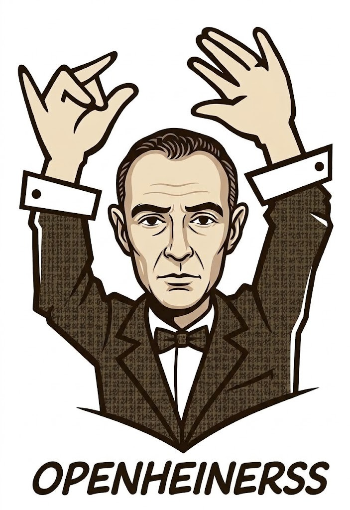
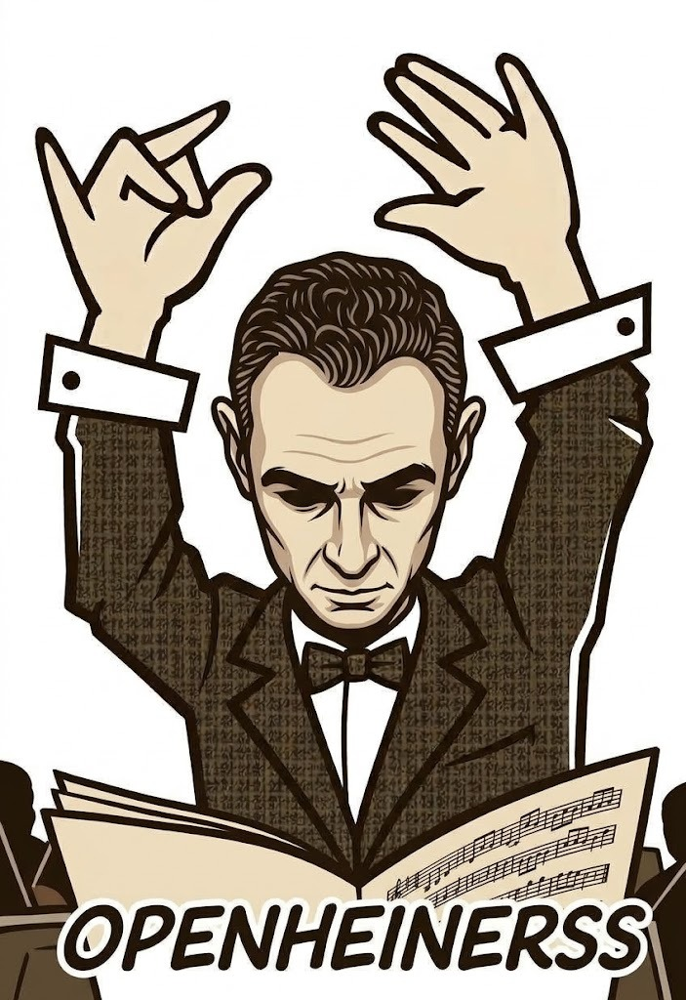

# 🎼 Openheinerss (OpenHarness)

<p align="center">
  
  &nbsp;&nbsp;&nbsp;&nbsp;
  
</p>

<p align="center">
  <strong>"Regendo a orquestra universal de agentes e harnesses de IA."</strong>
</p>

O **Openheinerss** é um maestro universal de orquestração de **AI Coding Agents** desenvolvido pela organização [crom-org](https://github.com/crom-org).

Em vez de prender sua aplicação ao Claude Code, OpenCode, Codex ou qualquer CLI proprietário, o Openheinerss fornece:
1. **Um binário Go de alta performance** que gerencia processos filhos, permissões bloqueantes e streaming em tempo real.
2. **Um protocolo unificado de mensagens (JSON-RPC 2.0 / NDJSON)** via STDIO e WebSocket (`:4820`).
3. **6 Harnesses plugáveis**:
   - `mock`: Motor de teste determinístico offline (0 tokens, simulação instantânea).
   - `claude-code`: Dual mode (SDK headless `@anthropic-ai/claude-agent-sdk` + CLI binário oficial `claude`).
   - `opencode`: Dual mode (CLI `opencode run` + API server com suporte nativo a Ollama/OpenAI/DeepSeek).
   - `codex`: Adaptador OpenAI Codex / Assistants API com gerenciamento de Threads e Runs.
   - `agy`: Adaptador para a suíte Google Antigravity (AGY CLI).
   - `aider`: Adaptador para o Aider CLI (pair programming em terminal com git commit automático).
4. **Hub centralizado de MCP (Model Context Protocol)** e persistência de sessões com checkpoints de restauração em `.openheinerss/`.
5. **SDKs Oficiais multilinguagem** para TypeScript/React, PHP e Python.

---

## 🧠 Controle de Cache e Otimização de Tokens

O Openheinerss padroniza e gerencia os diferentes níveis de cache disponíveis em cada ecossistema:

| Mecanismo de Cache | Provedores / Harnesses | Como Funciona no Openheinerss |
| :--- | :--- | :--- |
| **Prompt Caching Nativo** | `claude-code` (Anthropic Claude 3.5 Sonnet / Haiku / Opus) | Ativado por padrão para conexões diretas da Anthropic. Reduz até 90% do custo e latência de tokens em prompts repetidos e ferramentas MCP. |
| **Bypass de Cache para Terceiros** | `claude-code` (via OpenRouter, Zen, Groq, etc.) | Para provedores compatíveis que não suportam cabeçalhos específicos da Anthropic, o Openheinerss injeta automaticamente `DISABLE_PROMPT_CACHING=1` para evitar erros HTTP 400. |
| **KV-Cache em GPU/Memória** | `opencode`, `aider` (Ollama, vLLM, LM Studio) | Modelos locais reaproveitam o prefixo da árvore de atenção (Key-Value cache) na memória da GPU para turnos subsequentes da mesma sessão. |
| **Transcript Caching** | Todos os 6 harnesses | Histórico completo persistido em `.openheinerss/sessions/<session_id>.jsonl`. Permite retomar qualquer sessão (`session.resume`) sem reprocessamento redundante. |
| **File Checkpoints & Rollback** | Todos os 6 harnesses | Snapshots e backups locais antes de modificações arriscadas (`pkg/checkpoint`), permitindo desfazer alterações sem requisições adicionais de IA. |

---

## 💻 Suporte a Modelos Locais (100% Offline / Zero Custo)

O Openheinerss foi projetado para operar tanto na nuvem quanto em ambientes totalmente locais e offline:

1. **Ollama + OpenCode (`opencode`)**:
   ```bash
   # Rodar com Qwen 2.5 Coder via Ollama local (porta 11434):
   openheinerss run --harness opencode --model ollama/qwen2.5-coder:32b "Crie uma API REST"
   ```
2. **Ollama + Aider (`aider`)**:
   ```bash
   # Pair programming no terminal com DeepSeek-R1 local:
   openheinerss run --harness aider --model ollama/deepseek-r1:14b "Otimize este algoritmo"
   ```
3. **Motor Mock Determinístico (`mock`)**:
   ```bash
   # Teste end-to-end de UI/SDKs sem internet e sem consumir tokens de LLM:
   openheinerss run --harness mock "Analise este projeto"
   ```

---

## 🔄 Padronização Universal de Eventos

Todos os 6 motores são normalizados para o mesmo fluxo de eventos JSON-RPC 2.0 / NDJSON. A sua aplicação (seja em React, PHP, Python ou Go) consome qualquer modelo de IA de forma totalmente transparente e agnóstica:

```
[Cliente / SDK]  <--- WebSocket ou STDIO --->  [Openheinerss Core]
                                                       │
                     ┌───────────────────┬─────────────┴──────┬──────────────────┐
                     ▼                   ▼                    ▼                  ▼
             [claude-code]           [opencode]            [aider]            [codex/agy]
             (Anthropic/SDK)      (Ollama/DeepSeek)      (Pair CLI)        (OpenAI/Google)
```

### Eventos Emitidos por Qualquer Harness:
- `agent.thinking`: Pensamento ou raciocínio em tempo real (deliberation stream).
- `agent.text`: Deltas parciais de texto gerados para o usuário.
- `agent.tool_call`: Chamada de ferramenta (ex: leitura de arquivo, comando bash, MCP).
- `agent.tool_result`: Retorno da execução da ferramenta.
- `agent.permission_request`: Solicitação bloqueante de autorização com criticidade (`low`, `medium`, `high`).
- `agent.complete`: Conclusão do turno com estatísticas de tempo e contagem de tokens.
- `agent.error`: Erro estruturado com mensagem e sugestão acionável de correção (`suggestedFix`).

---

## ⚡ Início Rápido (CLI Go)

### 1. Diagnóstico do Sistema
Verifica se as dependências do ambiente estão prontas:
```bash
openheinerss doctor
```

### 2. Inicializar um Projeto
Cria a pasta `.openheinerss/` com configurações e servidores MCP:
```bash
openheinerss init
```

### 3. Execução Interativa no Terminal
Roda uma tarefa interativa com qualquer harness:
```bash
# Teste simulado determinístico (sem gastar tokens):
openheinerss run --harness mock "Analise o repositório"

# Com Claude Code ou OpenCode:
openheinerss run --harness claude-code --mode cli "Refatore a função de autenticação"
openheinerss run --harness opencode --model deepseek/deepseek-chat "Crie testes unitários"

# Com Aider, Codex ou Google Antigravity:
openheinerss run --harness aider "Adicione tipagem estrita"
openheinerss run --harness codex "Implemente testes unitários"
openheinerss run --harness agy "Revise a arquitetura de módulos"
```

### 4. Trocar de motor com uma linha

Crie `.openheinerss/motores.yaml` e associe cada papel a um perfil. O formato aceita
`papel: motor/modelo` e, opcionalmente, `esforco=low|medium|high`:

```yaml
roteirista: codex
revisor: claude-conta2/claude-sonnet-5-5
rapido: opencode/opencode/big-pickle esforco=low
```

Os únicos harnesses incluídos são `claude-code`, `codex`, `opencode`, `aider`,
`agy` e `mock`. Instâncias como `claude-conta2`, `codex2` e `cco-openrouter`
devem ser declaradas pelo usuário em `.openheinerss/harnesses/`, por exemplo:

```yaml
name: claude-conta2
base: claude-code
env: {CLAUDE_CONFIG_DIR: ~/.claude-conta2}
model: claude-sonnet-5-5
```

Liste os harnesses e papéis com `openheinerss motores` e rode uma tarefa com:
`openheinerss run --papel revisor "Revise este arquivo"`. Também é possível usar
diretamente `--motor claude-conta2`, depois de registrar a instância, com
`--modelo`/`--esforco` para substituir os valores do arquivo.

### 5. Iniciar Servidor Maestro
```bash
# Modo STDIO (para extensões de IDE e processos filhos):
openheinerss serve --stdio

# Modo WebSocket (para interfaces Web, React, Tauri, mobile):
openheinerss serve --port 4820
```

### 6. Rodar uma missão

Para executar uma tarefa com worktree, log compatível com a Central e troca
automática de instância, use:

```bash
openheinerss rodar <nome> <instância-ou-harness> [--modelo ...] [--esforco ...]
```

O prompt fica em `.claude/agentes/prompts/<nome>.md`. `--retomar` ou
`RETOMAR=1` preserva o log e continua a tarefa. Consulte
[`docs/07-rodar.md`](docs/07-rodar.md) para limites e reservas.

---

## 🌐 SDKs Oficiais da Comunidade

### 📦 TypeScript / Node / React (`@openheinerss/sdk`)
Localizado em [`sdk/typescript/`](./sdk/typescript):
```typescript
import { Openheinerss, useOpenheinerss } from "@openheinerss/sdk";

// Backend / Script:
const agent = new Openheinerss({ options: { harness: "claude-code" } });
agent.on("thinking", delta => console.log(delta));
agent.on("text", delta => process.stdout.write(delta));
agent.on("permission", async req => await req.allow());
await agent.prompt("Adicione endpoints na API");

// Frontend / React:
export function Chat() {
  const { messages, isThinking, prompt } = useOpenheinerss();
  return <button onClick={() => prompt("Refatore o layout")}>Enviar</button>;
}
```

### 🐘 PHP / Laravel (`openheinerss-sdk`)
Localizado em [`sdk/php/`](./sdk/php):
```php
use Openheinerss\Agent;

$agent = Agent::session(['harness' => 'opencode', 'model' => 'deepseek-coder']);
$res = $agent->prompt("Gere uma migration para a tabela faturas");
echo $res;
```

### 🐍 Python (`openheinerss`)
Localizado em [`sdk/python/`](./sdk/python):
```python
from openheinerss import Agent

agent = Agent(harness="claude-code", provider="openrouter")
for event in agent.stream("Analise este dataset"):
    if event["type"] == "agent.text":
        print(event["data"]["delta"], end="", flush=True)
```

---

## 🔌 Gerenciamento Centralizado de MCP

Gerencie os servidores de ferramentas do projeto diretamente pelo CLI:
```bash
# Listar servidores configurados:
openheinerss mcp list

# Adicionar um servidor MCP local:
openheinerss mcp add sqlite uvx mcp-server-sqlite --db-path dev.db
```

---

## 📚 Documentação Técnica Completa (`documentacao/`)

Acesse a documentação completa, detalhada e estruturada na pasta [`documentacao/`](./documentacao):

| Capítulo | Guia | O que você encontrará |
| :---: | :--- | :--- |
| **01** | [**Visão Geral & Manifesto**](./documentacao/01-visao-geral-e-manifesto.md) | O propósito do Openheinerss, problemas de fragmentação de CLIs, vantagens de Go e princípios centrais. |
| **02** | [**Arquitetura & Design do Sistema**](./documentacao/02-arquitetura-e-design.md) | Concorrência com Goroutines/canais, STDIO vs WebSocket (`:4820`), ciclo de vida de sessões e diretório `.openheinerss/`. |
| **03** | [**Especificação do Protocolo JSON-RPC 2.0**](./documentacao/03-especificacao-do-protocolo-rpc.md) | Todos os métodos (`session.start`, `session.prompt`, `session.permission`, `session.abort`, `session.resume`, etc.) e eventos de streaming. |
| **04** | [**Guia Completo dos 6 Harnesses**](./documentacao/04-guia-completo-de-harnesses.md) | Detalhamento exaustivo de `mock`, `claude-code`, `opencode`, `codex`, `agy` e `aider`. |
| **05** | [**Cache, Otimização de Tokens & Modelos Locais**](./documentacao/05-cache-otimizacao-e-modelos-locais.md) | Prompt caching, bypass de provedores de terceiros, KV-cache de GPU no Ollama/vLLM e tutorial passo a passo offline. |
| **06** | [**Hub Centralizado de MCP**](./documentacao/06-hub-mcp-e-extensibilidade.md) | Gerenciamento de ferramentas via `.openheinerss/mcp.json`, comandos `openheinerss mcp add/list` e exemplos com SQLite/Git. |
| **07** | [**Segurança, Permissões & Checkpoints**](./documentacao/07-checkpoints-seguranca-e-permissoes.md) | Modos de permissão (`prompt`, `auto_allow`, `deny`), níveis de severidade, handshake síncrono e snapshots/rollback de arquivos. |
| **08** | [**Guia de SDKs Oficiais**](./documentacao/08-sdks-oficiais.md) | Tutoriais de integração para TypeScript/Node/React, PHP/Laravel e Python com exemplos prontos para rodar. |
| **09** | [**Manual de Referência do CLI Go**](./documentacao/09-manual-do-cli.md) | Referência de todos os comandos do binário (`doctor`, `init`, `run`, `serve`, `mcp`, `version`), flags e variáveis de ambiente. |
| **10** | [**Guia de Desenvolvimento & Extensão**](./documentacao/10-guia-de-desenvolvimento-e-extensao.md) | Como implementar um novo adaptador de Harness em Go, rodar testes automatizados e contribuir com a organização [crom-org](https://github.com/crom-org). |

---

## Harnesses custom

Arquivos em `.openheinerss/harnesses/*.yaml` (ou JSON) e `~/.config/openheinerss/harnesses` são carregados sem recompilar. Use `base: claude-code` para herdar e sobrescreva `command`, `args`, `env`, `model`, `prompt` (`stdin` ou `argument`) e regexes de fim/cota. O comando custom escreve NDJSON com eventos `text`, `tool`, `error`, `usage` e `end`; veja [docs/06-harness-custom.md](docs/06-harness-custom.md).

```sh
openheinerss harness list
openheinerss harness add examples/cco-openrouter.yaml
openheinerss harness test cco-openrouter --prompt 'responda OK'
```

SDKs também expõem `registerHarness({...})` (método JSON-RPC `harness.register`).

## Orquestração ao vivo (WebSocket / STDIO)

O servidor (`openheinerss serve`, porta 4820) lança e acompanha agentes do `rodar`: `rodar.iniciar`, `rodar.listar`, `rodar.parar`, `rodar.decidir`, `limites.obter`, `harness.listar` e `eventos.assinar` (filtro por projeto e/ou agente). Quem assina recebe `orq.inicio`, `orq.progresso`, `orq.precisa_decisao`, `orq.erro` e `orq.fim`, inclusive de agentes lançados pelo CLI. Detalhes e exemplos JSON em [docs/02-protocol-spec.md](docs/02-protocol-spec.md#5-orquestração-rodar-limites-e-eventos-orq).

## 📄 Licença

Distribuído sob a licença MIT. Desenvolvido com orgulho pela organização [crom-org](https://github.com/crom-org).
