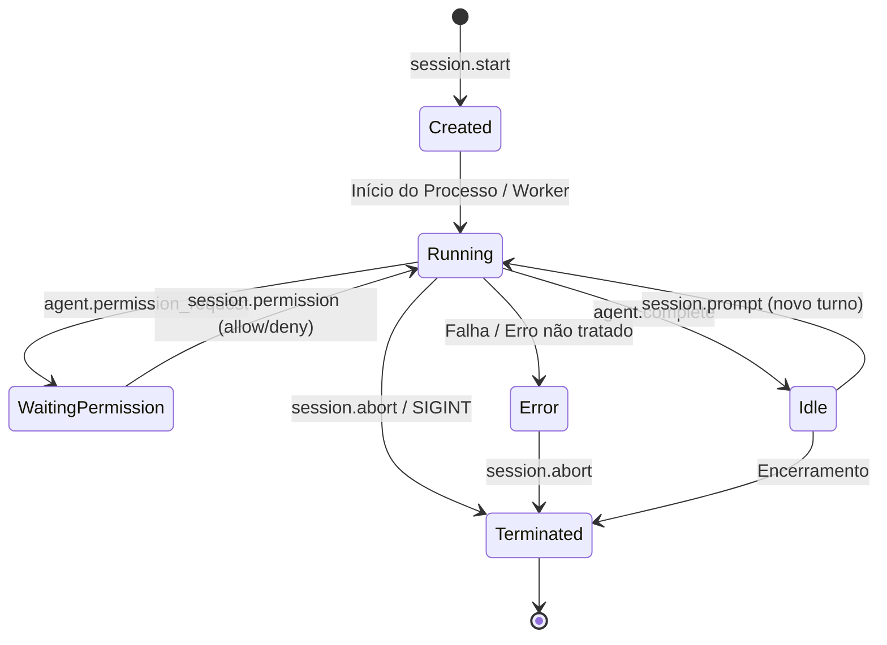

# 02 - Arquitetura & Design do Sistema

Este documento descreve detalhadamente a arquitetura interna do **Openheinerss**, sua divisão de pacotes em Go, o modelo de concorrência e os fluxos de dados entre transporte, gerenciador de sessão e adaptadores de harness.

---

## 1. Estrutura Modular de Pacotes (`pkg/`)

O Openheinerss é projetado seguindo os princípios de alta coesão e baixo acoplamento:

```
openheinerss/
├── cmd/openheinerss/           # Ponto de entrada CLI (Cobra/pflag)
│   └── main.go
├── pkg/
│   ├── protocol/               # Tipos JSON-RPC 2.0, mensagens e eventos normalizados
│   ├── server/                 # Servidores de transporte (STDIO e WebSocket :4820)
│   ├── session/                # Gerenciador de ciclo de vida e estado das sessões
│   ├── harness/                # Interface universal Harness e registro de motores
│   │   ├── mock/               # Motor determinístico de teste (offline)
│   │   ├── claudecode/         # Adaptador Claude Code (Dual Mode: SDK & CLI)
│   │   ├── opencode/           # Adaptador OpenCode (Dual Mode: CLI & API)
│   │   ├── codex/              # Adaptador OpenAI Codex / Assistants API
│   │   ├── agy/                # Adaptador Google Antigravity Suite
│   │   └── aider/              # Adaptador Aider Pair Programming
│   ├── mcp/                    # Hub centralizado do Model Context Protocol
│   ├── storage/                # Persistência de sessões e transcripts JSONL
│   ├── checkpoint/             # Gerenciador de snapshots de arquivos e git rollback
│   ├── doctor/                 # Verificação de diagnóstico e pré-requisitos do ambiente
│   └── config/                 # Gerenciamento de workspace (.openheinerss/)
├── sdk/                        # SDKs oficiais cliente
│   ├── typescript/             # Node.js, Deno, Bun e React Hook
│   ├── php/                    # PHP 8.1+ e Laravel
│   └── python/                 # Python 3.9+ (síncrono e assíncrono)
└── documentacao/               # Documentação técnica completa
```

---

## 2. Camadas de Transporte: STDIO vs WebSocket

O Openheinerss suporta dois meios de transporte bidirecionais:

### A. Transporte STDIO (`--stdio`)
- **Indicado para**: Extensões de editores (VSCode, JetBrains, Neovim), ferramentas CLI encadeadas e subprocessos pai.
- **Funcionamento**: A aplicação pai inicia o binário `openheinerss serve --stdio` como subprocesso e comunica-se lendo e escrevendo linhas delimitadas por `\n` (NDJSON) na entrada/saída padrão.
- **Vantagem**: Desempenho máximo, overhead de rede zero, sem necessidade de portas de rede abertas.

### B. Transporte WebSocket (`--port 4820`)
- **Indicado para**: Interfaces Web (React, Vue, Svelte), aplicações desktop (Tauri, Electron), mobile ou ambientes multi-client.
- **Funcionamento**: Um servidor HTTP/WebSocket em Go escuta na porta `4820` (ou na porta configurada via flag `--port`). O handshake inicial atualiza a conexão para WebSocket e troca mensagens JSON-RPC 2.0 em tempo real.
- **Vantagem**: Permite que múltiplos clientes observem o mesmo stream e interajam com as sessões de agentes.

---

## 3. Gerenciamento de Ciclo de Vida da Sessão (`pkg/session`)

Toda interação ocorre dentro do escopo de uma sessão isolada. O gerenciador de sessões mantém uma máquina de estados:



### Estados da Sessão:
1. **`Created`**: Sessão inicializada em memória, validando diretório de trabalho (`CWD`) e variáveis de ambiente.
2. **`Running`**: O harness está processando o prompt, executando o modelo ou rodando ferramentas.
3. **`WaitingPermission`**: O harness solicitou aprovação de uma ação crítica (ex: comando bash ou edição de arquivo). O fluxo fica pausado de maneira não bloqueante no Go Core até o cliente enviar `session.permission`.
4. **`Idle`**: O turno foi finalizado com sucesso. A sessão aguarda o próximo prompt do usuário ou encerramento.
5. **`Error`**: Ocorreu uma exceção no motor ou erro irrecuperável. O erro é propagado de forma padronizada.
6. **`Terminated`**: O processo filho e todos os recursos foram encerrados com liberação de memória e arquivos.

---

## 4. O Diretório de Trabalho do Projeto (`.openheinerss/`)

Ao executar `openheinerss init` em qualquer diretório de projeto, a estrutura padrão é gerada:

```
meu-projeto/
├── .openheinerss/
│   ├── config.yaml          # Configurações globais (harness padrão, portas, timeouts)
│   ├── mcp.json             # Definição central de servidores MCP (compartilhado por todos os motores)
│   ├── sessions/            # Transcripts de todas as conversas salvas em formato JSONL
│   │   ├── sess_abc123.jsonl
│   │   └── sess_xyz789.jsonl
│   └── checkpoints/         # Snapshots de arquivos modificados antes de rollbacks
│       └── chk_001/
└── ... código do projeto
```

Isso garante que todas as configurações do projeto fiquem desacopladas das ferramentas proprietárias e fiquem versionáveis caso a equipe deseje commitar `.openheinerss/config.yaml` e `.openheinerss/mcp.json`.
