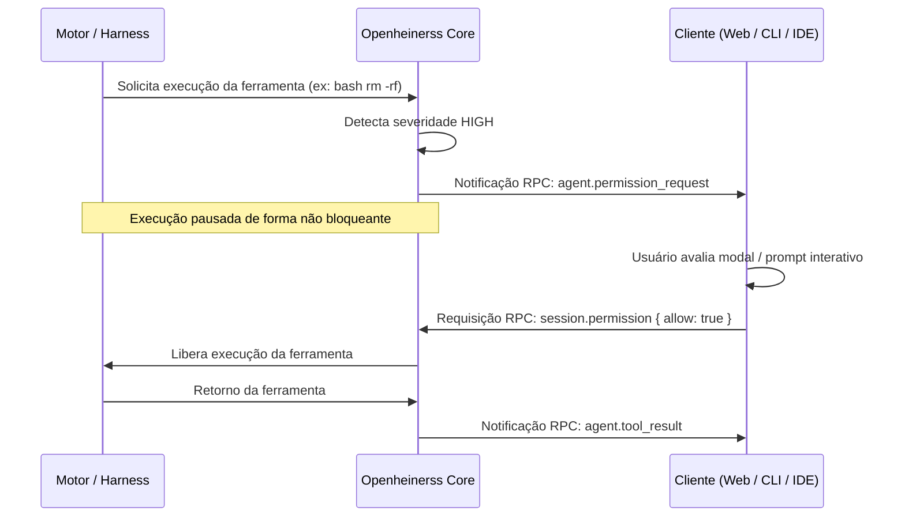

# 07 - Segurança, Permissões & Checkpoints de Arquivos

Uma das maiores preocupações ao conceder acesso ao terminal e ao sistema de arquivos para agentes de inteligência artificial é a **integridade dos dados e do ambiente**.

O Openheinerss introduz um modelo de segurança em duas frentes: **interceptação ativa de permissões** e **checkpoints atômicos de rollback**.

---

## 1. Modos de Operação de Permissão

Ao iniciar uma sessão (`session.start`), o parâmetro `permission_mode` dita a política de execução:

| Modo de Permissão | Comportamento | Casos de Uso |
| :--- | :--- | :--- |
| **`prompt` (Padrão)** | Toda ação crítica pausa o agente e aguarda a decisão do usuário em tempo real. | Desenvolvimento local interativo, terminais, IDEs. |
| **`auto_allow`** | Todas as ferramentas são executadas sem confirmação humana. | Ambientes isolados em contêineres Docker, pipelines de CI/CD descartáveis. |
| **`deny`** | Nenhuma ação que modifique o sistema é permitida (somente leitura). | Auditoria de código, análise de vulnerabilidades, leitura de logs. |

---

## 2. Níveis de Criticidade (Severidade)

Cada ferramenta interceptada é classificada pelo Openheinerss com um nível de severidade:

- **`low` (Baixo)**: Operações somente leitura (ex: `cat main.go`, `git status`, `ls -la`). Geralmente executadas automaticamente.
- **`medium` (Médio)**: Criação ou edição de arquivos de código no workspace do projeto, instalação de pacotes locais (`go get`, `npm install`).
- **`high` (Alto)**: Execução de scripts de terminal arbitrários, remoção de arquivos e pastas (`rm -rf`), comandos Git destrutivos (`git reset --hard`), migrations ou operações em bancos de dados.

---

## 3. O Handshake Síncrono de Permissão

Quando um comando de severidade alta ou média é gerado pelo modelo:

Se o usuário rejeitar (`allow: false`), o Openheinerss instrui o modelo imediatamente informando que a ação foi negada pelo operador, permitindo que a IA sugira uma alternativa mais segura.

---

## 4. Checkpoints de Arquivos & Rollback (`pkg/checkpoint`)

Para proteger o repositório contra edições defeituosas ou comandos que corrompam a base de código:

1. **Snapshot Automático**: Antes de aplicar modificações em arquivos através de ferramentas de edição, o Openheinerss salva uma fotografia compactada dos arquivos originais em `.openheinerss/checkpoints/`.
2. **Restauração Imediata (`rewindFiles`)**: Se um teste quebrar ou se o usuário não aprovar o resultado final da refatoração, o sistema restaura o estado exato anterior em milissegundos sem depender de novas chamadas ao modelo de IA.
